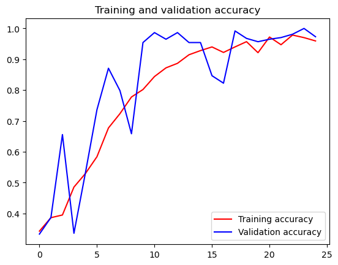

实验内容
```python
import ssl
from pathlib import Path
from urllib.error import URLError
from urllib.request import urlopen

DOWNLOAD_DIR = Path("D:/mldownload")
DOWNLOAD_DIR.mkdir(parents=True, exist_ok=True)

RPS_URL = "https://storage.googleapis.com/learning-datasets/rps.zip"
RPS_TEST_URL = "https://storage.googleapis.com/learning-datasets/rps-test-set.zip"
RPS_ZIP = DOWNLOAD_DIR / "rps.zip"
RPS_TEST_ZIP = DOWNLOAD_DIR / "rps-test-set.zip"

def download_file(url, destination):
    if destination.exists() and destination.stat().st_size > 0:
        print(f"File already exists, skipping: {destination}")
        return

    temp_path = destination.with_suffix(destination.suffix + ".part")
    print(f"Downloading: {url}")

    try:
        response = urlopen(url, timeout=120)
    except URLError:
        context = ssl._create_unverified_context()
        response = urlopen(url, timeout=120, context=context)

    with response, temp_path.open("wb") as file:
        while True:
            data = response.read(1024 * 1024)
            if not data:
                break
            file.write(data)

    temp_path.replace(destination)
    size_mb = destination.stat().st_size / 1024 / 1024
    print(f"Downloaded: {destination} ({size_mb:.1f} MB)")

download_file(RPS_URL, RPS_ZIP)
download_file(RPS_TEST_URL, RPS_TEST_ZIP)

```

    Downloading: https://storage.googleapis.com/learning-datasets/rps.zip
    Downloaded: D:\mldownload\rps.zip (191.4 MB)
    Downloading: https://storage.googleapis.com/learning-datasets/rps-test-set.zip
    Downloaded: D:\mldownload\rps-test-set.zip (28.1 MB)
    


```python
import zipfile

def extract_zip(zip_path, extract_dir):
    if not zip_path.exists():
        raise FileNotFoundError(f"Zip file not found. Run the download cell first: {zip_path}")

    with zipfile.ZipFile(zip_path, "r") as zip_ref:
        bad_file = zip_ref.testzip()
        if bad_file is not None:
            raise zipfile.BadZipFile(
                f"Zip file looks corrupted at {bad_file}. Delete {zip_path} and download again."
            )
        zip_ref.extractall(extract_dir)

    print(f"Extracted: {zip_path} -> {extract_dir}")

extract_zip(RPS_ZIP, DOWNLOAD_DIR)
extract_zip(RPS_TEST_ZIP, DOWNLOAD_DIR)

```

    Extracted: D:\mldownload\rps.zip -> D:\mldownload
    Extracted: D:\mldownload\rps-test-set.zip -> D:\mldownload
    


```python
rock_dir = DOWNLOAD_DIR / "rps" / "rock"
paper_dir = DOWNLOAD_DIR / "rps" / "paper"
scissors_dir = DOWNLOAD_DIR / "rps" / "scissors"

for image_dir in [rock_dir, paper_dir, scissors_dir]:
    if not image_dir.exists():
        raise FileNotFoundError(
            f"Directory not found: {image_dir}. Run the download and extract cells first."
        )

rock_files = sorted(path.name for path in rock_dir.iterdir())
paper_files = sorted(path.name for path in paper_dir.iterdir())
scissors_files = sorted(path.name for path in scissors_dir.iterdir())

print("total training rock images:", len(rock_files))
print("total training paper images:", len(paper_files))
print("total training scissors images:", len(scissors_files))

print(rock_files[:10])
print(paper_files[:10])
print(scissors_files[:10])

```

    total training rock images: 840
    total training paper images: 840
    total training scissors images: 840
    ['rock01-000.png', 'rock01-001.png', 'rock01-002.png', 'rock01-003.png', 'rock01-004.png', 'rock01-005.png', 'rock01-006.png', 'rock01-007.png', 'rock01-008.png', 'rock01-009.png']
    ['paper01-000.png', 'paper01-001.png', 'paper01-002.png', 'paper01-003.png', 'paper01-004.png', 'paper01-005.png', 'paper01-006.png', 'paper01-007.png', 'paper01-008.png', 'paper01-009.png']
    ['scissors01-000.png', 'scissors01-001.png', 'scissors01-002.png', 'scissors01-003.png', 'scissors01-004.png', 'scissors01-005.png', 'scissors01-006.png', 'scissors01-007.png', 'scissors01-008.png', 'scissors01-009.png']
    


```python
%matplotlib inline

import matplotlib.pyplot as plt
import matplotlib.image as mpimg

pic_index = 2

next_rock = [rock_dir / fname for fname in rock_files[pic_index - 2:pic_index]]
next_paper = [paper_dir / fname for fname in paper_files[pic_index - 2:pic_index]]
next_scissors = [scissors_dir / fname for fname in scissors_files[pic_index - 2:pic_index]]

for img_path in next_rock + next_paper + next_scissors:
    img = mpimg.imread(img_path)
    plt.imshow(img)
    plt.axis("off")
    plt.show()

```


    

    


    

    


    

    


    

    


    

    


    

    


```python
import tensorflow as tf
from tensorflow.keras.preprocessing import image
from tensorflow.keras.preprocessing.image import ImageDataGenerator

# 后面的代码完全不变
TRAINING_DIR = "D:/mldownload/rps/"
training_datagen = ImageDataGenerator(
    rescale=1./255,
    rotation_range=40,
    width_shift_range=0.2,
    height_shift_range=0.2,
    shear_range=0.2,
    zoom_range=0.2,
    horizontal_flip=True,
    fill_mode='nearest')

VALIDATION_DIR = "D:/mldownload/rps-test-set/"
validation_datagen = ImageDataGenerator(rescale=1./255)

train_generator = training_datagen.flow_from_directory(
    TRAINING_DIR,
    target_size=(150,150),
    class_mode='categorical',
    batch_size=128
)

validation_generator = validation_datagen.flow_from_directory(
    VALIDATION_DIR,
    target_size=(150,150),
    class_mode='categorical',
    batch_size=128
)

model = tf.keras.models.Sequential([
    tf.keras.layers.Conv2D(64, (3,3), activation='relu', input_shape=(150, 150, 3)),
    tf.keras.layers.MaxPooling2D(2, 2),
    tf.keras.layers.Conv2D(64, (3,3), activation='relu'),
    tf.keras.layers.MaxPooling2D(2,2),
    tf.keras.layers.Conv2D(128, (3,3), activation='relu'),
    tf.keras.layers.MaxPooling2D(2,2),
    tf.keras.layers.Conv2D(128, (3,3), activation='relu'),
    tf.keras.layers.MaxPooling2D(2,2),
    tf.keras.layers.Flatten(),
    tf.keras.layers.Dropout(0.5),
    tf.keras.layers.Dense(512, activation='relu'),
    tf.keras.layers.Dense(3, activation='softmax')
])

model.summary()

model.compile(loss='categorical_crossentropy', optimizer='rmsprop', metrics=['accuracy'])

history = model.fit(train_generator, epochs=25, steps_per_epoch=28, 
                    validation_data=validation_generator, verbose=1, validation_steps=3)

model.save("rps.h5")
```

    Found 2520 images belonging to 3 classes.
    Found 372 images belonging to 3 classes.
    

    E:\anaconda3\Lib\site-packages\keras\src\layers\convolutional\base_conv.py:113: UserWarning: Do not pass an `input_shape`/`input_dim` argument to a layer. When using Sequential models, prefer using an `Input(shape)` object as the first layer in the model instead.
      super().__init__(activity_regularizer=activity_regularizer, **kwargs)
    


<pre style="white-space:pre;overflow-x:auto;line-height:normal;font-family:Menlo,'DejaVu Sans Mono',consolas,'Courier New',monospace"><span style="font-weight: bold">Model: "sequential"</span>
</pre>


<pre style="white-space:pre;overflow-x:auto;line-height:normal;font-family:Menlo,'DejaVu Sans Mono',consolas,'Courier New',monospace">┏━━━━━━━━━━━━━━━━━━━━━━━━━━━━━━━━━┳━━━━━━━━━━━━━━━━━━━━━━━━┳━━━━━━━━━━━━━━━┓
┃<span style="font-weight: bold"> Layer (type)                    </span>┃<span style="font-weight: bold"> Output Shape           </span>┃<span style="font-weight: bold">       Param # </span>┃
┡━━━━━━━━━━━━━━━━━━━━━━━━━━━━━━━━━╇━━━━━━━━━━━━━━━━━━━━━━━━╇━━━━━━━━━━━━━━━┩
│ conv2d (<span style="color: #0087ff; text-decoration-color: #0087ff">Conv2D</span>)                 │ (<span style="color: #00d7ff; text-decoration-color: #00d7ff">None</span>, <span style="color: #00af00; text-decoration-color: #00af00">148</span>, <span style="color: #00af00; text-decoration-color: #00af00">148</span>, <span style="color: #00af00; text-decoration-color: #00af00">64</span>)   │         <span style="color: #00af00; text-decoration-color: #00af00">1,792</span> │
├─────────────────────────────────┼────────────────────────┼───────────────┤
│ max_pooling2d (<span style="color: #0087ff; text-decoration-color: #0087ff">MaxPooling2D</span>)    │ (<span style="color: #00d7ff; text-decoration-color: #00d7ff">None</span>, <span style="color: #00af00; text-decoration-color: #00af00">74</span>, <span style="color: #00af00; text-decoration-color: #00af00">74</span>, <span style="color: #00af00; text-decoration-color: #00af00">64</span>)     │             <span style="color: #00af00; text-decoration-color: #00af00">0</span> │
├─────────────────────────────────┼────────────────────────┼───────────────┤
│ conv2d_1 (<span style="color: #0087ff; text-decoration-color: #0087ff">Conv2D</span>)               │ (<span style="color: #00d7ff; text-decoration-color: #00d7ff">None</span>, <span style="color: #00af00; text-decoration-color: #00af00">72</span>, <span style="color: #00af00; text-decoration-color: #00af00">72</span>, <span style="color: #00af00; text-decoration-color: #00af00">64</span>)     │        <span style="color: #00af00; text-decoration-color: #00af00">36,928</span> │
├─────────────────────────────────┼────────────────────────┼───────────────┤
│ max_pooling2d_1 (<span style="color: #0087ff; text-decoration-color: #0087ff">MaxPooling2D</span>)  │ (<span style="color: #00d7ff; text-decoration-color: #00d7ff">None</span>, <span style="color: #00af00; text-decoration-color: #00af00">36</span>, <span style="color: #00af00; text-decoration-color: #00af00">36</span>, <span style="color: #00af00; text-decoration-color: #00af00">64</span>)     │             <span style="color: #00af00; text-decoration-color: #00af00">0</span> │
├─────────────────────────────────┼────────────────────────┼───────────────┤
│ conv2d_2 (<span style="color: #0087ff; text-decoration-color: #0087ff">Conv2D</span>)               │ (<span style="color: #00d7ff; text-decoration-color: #00d7ff">None</span>, <span style="color: #00af00; text-decoration-color: #00af00">34</span>, <span style="color: #00af00; text-decoration-color: #00af00">34</span>, <span style="color: #00af00; text-decoration-color: #00af00">128</span>)    │        <span style="color: #00af00; text-decoration-color: #00af00">73,856</span> │
├─────────────────────────────────┼────────────────────────┼───────────────┤
│ max_pooling2d_2 (<span style="color: #0087ff; text-decoration-color: #0087ff">MaxPooling2D</span>)  │ (<span style="color: #00d7ff; text-decoration-color: #00d7ff">None</span>, <span style="color: #00af00; text-decoration-color: #00af00">17</span>, <span style="color: #00af00; text-decoration-color: #00af00">17</span>, <span style="color: #00af00; text-decoration-color: #00af00">128</span>)    │             <span style="color: #00af00; text-decoration-color: #00af00">0</span> │
├─────────────────────────────────┼────────────────────────┼───────────────┤
│ conv2d_3 (<span style="color: #0087ff; text-decoration-color: #0087ff">Conv2D</span>)               │ (<span style="color: #00d7ff; text-decoration-color: #00d7ff">None</span>, <span style="color: #00af00; text-decoration-color: #00af00">15</span>, <span style="color: #00af00; text-decoration-color: #00af00">15</span>, <span style="color: #00af00; text-decoration-color: #00af00">128</span>)    │       <span style="color: #00af00; text-decoration-color: #00af00">147,584</span> │
├─────────────────────────────────┼────────────────────────┼───────────────┤
│ max_pooling2d_3 (<span style="color: #0087ff; text-decoration-color: #0087ff">MaxPooling2D</span>)  │ (<span style="color: #00d7ff; text-decoration-color: #00d7ff">None</span>, <span style="color: #00af00; text-decoration-color: #00af00">7</span>, <span style="color: #00af00; text-decoration-color: #00af00">7</span>, <span style="color: #00af00; text-decoration-color: #00af00">128</span>)      │             <span style="color: #00af00; text-decoration-color: #00af00">0</span> │
├─────────────────────────────────┼────────────────────────┼───────────────┤
│ flatten (<span style="color: #0087ff; text-decoration-color: #0087ff">Flatten</span>)               │ (<span style="color: #00d7ff; text-decoration-color: #00d7ff">None</span>, <span style="color: #00af00; text-decoration-color: #00af00">6272</span>)           │             <span style="color: #00af00; text-decoration-color: #00af00">0</span> │
├─────────────────────────────────┼────────────────────────┼───────────────┤
│ dropout (<span style="color: #0087ff; text-decoration-color: #0087ff">Dropout</span>)               │ (<span style="color: #00d7ff; text-decoration-color: #00d7ff">None</span>, <span style="color: #00af00; text-decoration-color: #00af00">6272</span>)           │             <span style="color: #00af00; text-decoration-color: #00af00">0</span> │
├─────────────────────────────────┼────────────────────────┼───────────────┤
│ dense (<span style="color: #0087ff; text-decoration-color: #0087ff">Dense</span>)                   │ (<span style="color: #00d7ff; text-decoration-color: #00d7ff">None</span>, <span style="color: #00af00; text-decoration-color: #00af00">512</span>)            │     <span style="color: #00af00; text-decoration-color: #00af00">3,211,776</span> │
├─────────────────────────────────┼────────────────────────┼───────────────┤
│ dense_1 (<span style="color: #0087ff; text-decoration-color: #0087ff">Dense</span>)                 │ (<span style="color: #00d7ff; text-decoration-color: #00d7ff">None</span>, <span style="color: #00af00; text-decoration-color: #00af00">3</span>)              │         <span style="color: #00af00; text-decoration-color: #00af00">1,539</span> │
└─────────────────────────────────┴────────────────────────┴───────────────┘
</pre>


<pre style="white-space:pre;overflow-x:auto;line-height:normal;font-family:Menlo,'DejaVu Sans Mono',consolas,'Courier New',monospace"><span style="font-weight: bold"> Total params: </span><span style="color: #00af00; text-decoration-color: #00af00">3,473,475</span> (13.25 MB)
</pre>


<pre style="white-space:pre;overflow-x:auto;line-height:normal;font-family:Menlo,'DejaVu Sans Mono',consolas,'Courier New',monospace"><span style="font-weight: bold"> Trainable params: </span><span style="color: #00af00; text-decoration-color: #00af00">3,473,475</span> (13.25 MB)
</pre>


<pre style="white-space:pre;overflow-x:auto;line-height:normal;font-family:Menlo,'DejaVu Sans Mono',consolas,'Courier New',monospace"><span style="font-weight: bold"> Non-trainable params: </span><span style="color: #00af00; text-decoration-color: #00af00">0</span> (0.00 B)
</pre>


    WARNING:tensorflow:TensorFlow GPU support is not available on native Windows for TensorFlow >= 2.11. Even if CUDA/cuDNN are installed, GPU will not be used. Please use WSL2 or the TensorFlow-DirectML plugin.
    Epoch 1/25
    20/28 ━━━━━━━━━━━━━━━━━━━━ 5s 746ms/step - accuracy: 0.3223 - loss: 1.4981

    E:\anaconda3\Lib\site-packages\keras\src\trainers\epoch_iterator.py:116: UserWarning: Your input ran out of data; interrupting training. Make sure that your dataset or generator can generate at least `steps_per_epoch * epochs` batches. You may need to use the `.repeat()` function when building your dataset.
      self._interrupted_warning()
    

    28/28 ━━━━━━━━━━━━━━━━━━━━ 18s 572ms/step - accuracy: 0.3429 - loss: 1.2519 - val_accuracy: 0.3333 - val_loss: 1.0937
    Epoch 2/25
    28/28 ━━━━━━━━━━━━━━━━━━━━ 16s 544ms/step - accuracy: 0.3865 - loss: 1.0897 - val_accuracy: 0.3871 - val_loss: 0.9816
    Epoch 3/25
    28/28 ━━━━━━━━━━━━━━━━━━━━ 15s 540ms/step - accuracy: 0.3952 - loss: 1.1840 - val_accuracy: 0.6559 - val_loss: 0.9829
    Epoch 4/25
    28/28 ━━━━━━━━━━━━━━━━━━━━ 15s 542ms/step - accuracy: 0.4857 - loss: 1.0233 - val_accuracy: 0.3360 - val_loss: 1.0499
    Epoch 5/25
    28/28 ━━━━━━━━━━━━━━━━━━━━ 15s 538ms/step - accuracy: 0.5298 - loss: 0.9239 - val_accuracy: 0.5323 - val_loss: 0.8019
    Epoch 6/25
    28/28 ━━━━━━━━━━━━━━━━━━━━ 15s 534ms/step - accuracy: 0.5841 - loss: 0.8747 - val_accuracy: 0.7366 - val_loss: 0.4836
    Epoch 7/25
    28/28 ━━━━━━━━━━━━━━━━━━━━ 15s 536ms/step - accuracy: 0.6774 - loss: 0.7179 - val_accuracy: 0.8710 - val_loss: 0.4888
    Epoch 8/25
    28/28 ━━━━━━━━━━━━━━━━━━━━ 22s 802ms/step - accuracy: 0.7238 - loss: 0.6792 - val_accuracy: 0.7984 - val_loss: 0.3864
    Epoch 9/25
    28/28 ━━━━━━━━━━━━━━━━━━━━ 26s 889ms/step - accuracy: 0.7778 - loss: 0.5524 - val_accuracy: 0.6586 - val_loss: 0.6158
    Epoch 10/25
    28/28 ━━━━━━━━━━━━━━━━━━━━ 25s 871ms/step - accuracy: 0.8020 - loss: 0.4771 - val_accuracy: 0.9543 - val_loss: 0.1590
    Epoch 11/25
    28/28 ━━━━━━━━━━━━━━━━━━━━ 25s 898ms/step - accuracy: 0.8440 - loss: 0.3851 - val_accuracy: 0.9866 - val_loss: 0.1021
    Epoch 12/25
    28/28 ━━━━━━━━━━━━━━━━━━━━ 24s 834ms/step - accuracy: 0.8722 - loss: 0.3019 - val_accuracy: 0.9651 - val_loss: 0.1821
    Epoch 13/25
    28/28 ━━━━━━━━━━━━━━━━━━━━ 25s 866ms/step - accuracy: 0.8869 - loss: 0.3193 - val_accuracy: 0.9866 - val_loss: 0.0508
    Epoch 14/25
    28/28 ━━━━━━━━━━━━━━━━━━━━ 25s 876ms/step - accuracy: 0.9147 - loss: 0.2173 - val_accuracy: 0.9543 - val_loss: 0.0880
    Epoch 15/25
    28/28 ━━━━━━━━━━━━━━━━━━━━ 24s 841ms/step - accuracy: 0.9282 - loss: 0.2013 - val_accuracy: 0.9543 - val_loss: 0.1924
    Epoch 16/25
    28/28 ━━━━━━━━━━━━━━━━━━━━ 17s 588ms/step - accuracy: 0.9401 - loss: 0.1575 - val_accuracy: 0.8468 - val_loss: 0.3780
    Epoch 17/25
    28/28 ━━━━━━━━━━━━━━━━━━━━ 16s 544ms/step - accuracy: 0.9222 - loss: 0.2122 - val_accuracy: 0.8226 - val_loss: 0.6065
    Epoch 18/25
    28/28 ━━━━━━━━━━━━━━━━━━━━ 19s 680ms/step - accuracy: 0.9401 - loss: 0.1674 - val_accuracy: 0.9919 - val_loss: 0.0316
    Epoch 19/25
    28/28 ━━━━━━━━━━━━━━━━━━━━ 24s 851ms/step - accuracy: 0.9571 - loss: 0.1134 - val_accuracy: 0.9677 - val_loss: 0.0624
    Epoch 20/25
    28/28 ━━━━━━━━━━━━━━━━━━━━ 22s 787ms/step - accuracy: 0.9214 - loss: 0.1987 - val_accuracy: 0.9570 - val_loss: 0.1185
    Epoch 21/25
    28/28 ━━━━━━━━━━━━━━━━━━━━ 22s 775ms/step - accuracy: 0.9722 - loss: 0.0739 - val_accuracy: 0.9651 - val_loss: 0.1317
    Epoch 22/25
    28/28 ━━━━━━━━━━━━━━━━━━━━ 20s 695ms/step - accuracy: 0.9472 - loss: 0.1399 - val_accuracy: 0.9704 - val_loss: 0.0573
    Epoch 23/25
    28/28 ━━━━━━━━━━━━━━━━━━━━ 15s 530ms/step - accuracy: 0.9786 - loss: 0.0707 - val_accuracy: 0.9812 - val_loss: 0.0425
    Epoch 24/25
    28/28 ━━━━━━━━━━━━━━━━━━━━ 15s 528ms/step - accuracy: 0.9702 - loss: 0.0889 - val_accuracy: 1.0000 - val_loss: 0.0337
    Epoch 25/25
    28/28 ━━━━━━━━━━━━━━━━━━━━ 15s 533ms/step - accuracy: 0.9595 - loss: 0.1139 - val_accuracy: 0.9731 - val_loss: 0.0390
    

    WARNING:absl:You are saving your model as an HDF5 file via `model.save()` or `keras.saving.save_model(model)`. This file format is considered legacy. We recommend using instead the native Keras format, e.g. `model.save('my_model.keras')` or `keras.saving.save_model(model, 'my_model.keras')`. 
    


```python
import matplotlib.pyplot as plt
acc = history.history['accuracy']
val_acc = history.history['val_accuracy']
loss = history.history['loss']
val_loss = history.history['val_loss']

epochs = range(len(acc))

plt.plot(epochs, acc, 'r', label='Training accuracy')
plt.plot(epochs, val_acc, 'b', label='Validation accuracy')
plt.title('Training and validation accuracy')
plt.legend(loc=0)
plt.figure()
plt.show()

```


    

    


    <Figure size 640x480 with 0 Axes>
    训练模型结果图


```python

```
